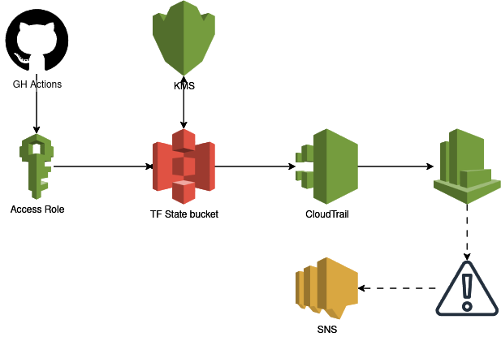

# Secure Terraform State Backend via CloudFormation

This CloudFormation template deploys a secure and robust backend for managing Terraform state in AWS. It follows security best practices by creating a least-privilege environment with comprehensive auditing and optional real-time notifications.

This setup is ideal for teams who need a centralized, secure, and auditable way to manage their infrastructure's state, preventing conflicts and protecting sensitive information.

## Key Features
- Secure S3 State Bucket: Provisions an S3 bucket with versioning, enforced encryption, and public access completely blocked.

- Customer-Managed KMS Key: Creates a dedicated AWS KMS key for encrypting the state file, giving you full control over the encryption key's lifecycle and access policy. The key policy is restricted to only allow use with the designated S3 bucket.

- Least-Privilege IAM Policies: Implements strict S3 bucket and KMS key policies, ensuring that only specified IAM roles (e.g., administrators, CI/CD pipeline roles) can access or modify the state file.

- Comprehensive Auditing: Deploys an AWS CloudTrail trail that specifically monitors all data events (GetObject, PutObject, DeleteObject) for the state bucket.

- Centralized Logging: Forwards all audit logs to a CloudWatch Log Group for easy searching, analysis, and long-term retention.

- Optional Real-Time Alerts: Includes an optional feature to create a CloudWatch Alarm that triggers on any state file modifications, deletions, or access-denied errors. This alarm integrates with an SNS topic to send instant notifications.

## Architecture Diagram




## How to Deploy
### Prerequisites

- An AWS account.

- An IAM Role with permissions to create the resources defined in the template.

- (Optional) An SNS Topic ARN if you plan to enable notifications.

### Deployment 

Follow the link for deployment instructions.

- [AWS Management Console](./docs/console.md)
- [AWS CLI](./docs/cli.md)


### Parameters

| Parameter | Description | Required | Default Value |
| ----------- | ----------- | ----------- | ----------- |
| `S3BucketName` | A globally unique name for the S3 bucket that will store the Terraform state file. | Yes | - |
| `CloudTrailLogBucketName` | A globally unique name for the S3 bucket that will store the audit logs from CloudTrail. |Yes | -
| `LogRetentionInDays` | The number of days to keep the audit logs in CloudWatch. |Yes | 90 | 
| `AllowedAdminRoleArns` | A comma-separated list of IAM Role ARNs that are allowed to read and write the Terraform state. | Yes | - |
| `EnableNotifications` |Set to true to enable SNS notifications for state file changes. | Yes |  false |
| `NotificationSnsTopicArn` | If notifications are enabled, this is the ARN of the SNS topic to which alerts will be sent. | No | - |

### Post-Deployment: Configuring Terraform

After the CloudFormation stack has been successfully created, you can configure your Terraform project to use this secure backend. Use the values from the Outputs tab of the CloudFormation stack.

Add the following backend block to your Terraform configuration (e.g., in a backend.tf file):

```
terraform {
  backend "s3" {
    bucket         = "your-terraform-state-bucket-name" # <-- Output: S3BucketName
    key            = "path/to/your/project/terraform.tfstate"
    region         = "eu-west-2" # Or your desired region
    encrypt        = true
    kms_key_id     = "arn:aws:kms:eu-west-2:123456789012:key/your-key-id" # <-- Output: KMSKeyArn
    use_lockfile   = true
  }
}
```

**Note:** State locking is natively supported by S3 in recent Terraform versions, so a `dynamodb_table` is no longer required. You will need to use terraform in version 1.10 or never

### Outputs

The stack provides the following outputs for your convenience:

| Output | Description |
| ---- | ---- |
| `S3BucketName` | The name of the created S3 bucket for the Terraform |state.
| `KMSKeyArn` | The ARN of the KMS key used for encryption. |
| `CloudTrailLogBucketName` | The name of the S3 bucket storing the CloudTrail audit logs. |
| `CloudWatchLogGroupName` | The name of the CloudWatch Log Group where audit logs are stored. | 
| `AlarmName` | (If enabled) The name of the CloudWatch Alarm monitoring the state file. |